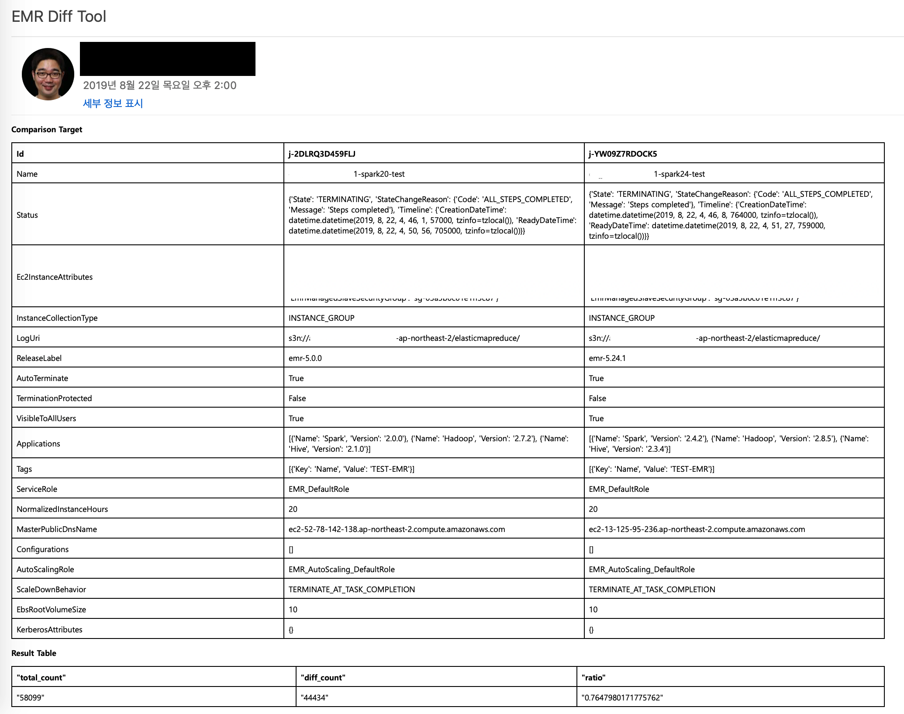

# Basketball Tool : diff check of outputs when upgrading EMR


This software compares the output and running time of the EMR cluster.

The architecture has been designed that users can throw(like shooting) a request, and receive a result(like score) by email, as if they were playing a basketball game.

This request contains CLIs (emr-cli-1, emr-cli-2) that creates two EMR clusters to be compared, the S3 URI of their output, SQL that compares the outputs (table1, table2), and an email address to receive reports (subscriber-email).

And the request can be modified appropriately to be used for 

1. Checking the differences of inputs of two clusters when upgrading EMR.
2. EMR Right Sizing.

For example, if you write different versions of emr-cli-1 and emr-cli-2, it will be an upgrading comparison. And if you write different instance types of emr-cli-1 and emr-cli-2, it will be Right Sizing.

```bash
.
├── README.md                   <-- This instructions file
├── event.json                  <-- API Gateway Proxy Integration event payload
├── request.txt                 <-- request.txt will trigger main Lambda function
├── requirements.txt
├── src
│   ├── athena_query.py         <-- Lambda function code for querying to Athena
│   ├── requirements.txt
│   ├── s3_checker1.py          <-- Lambda function code for checking if job1 is terminated
│   ├── s3_checker2.py          <-- Lambda function code for checking if job2 is terminated
│   ├── scorer.py               <-- Lambda function code for sending report
│   ├── shoot.py                <-- Main Lambda function code for starting job1 and job2 of EMR
│   └── update-shoot-func.sh    <-- Updating shoot.py and Zip File to Lambda function code
└── template.yaml               <-- SAM Template
```

## Requirements

* AWS CLI already configured with Administrator permission
* [Python 3 installed](https://www.python.org/downloads/)
* [Docker installed](https://www.docker.com/community-edition)
* [AWS Serverless Application Model installed](https://docs.aws.amazon.com/serverless-application-model/latest/developerguide/serverless-sam-cli-install.html)

## Setup process

**Downloading the source**

```bash
git clone git@github.com:aws-samples/aws-emr-basketball-tool.git
```

**Create a bucket for CloudFormation**

```bash
Date=$(date +'%d%m%Y-%H%M%S')
aws s3 mb s3://baseket-ball-cfn-$Date
```

## Packaging and deployment


This source code is configured for SAM CLI.

**SAM build, package, and deploy**

```bash

cd aws-emr-basketball-tool/

NotificationBucket='basketball-tool-bucket-20190821'

sam build

sam package \
    --template-file .aws-sam/build/template.yaml \
    --output-template-file packaged.yaml \
    --s3-bucket baseket-ball-cfn-$Date

sam deploy \
    --template-file packaged.yaml \
    --stack-name BasketBallTool \
    --capabilities CAPABILITY_IAM \
    --region ap-northeast-2 \
    --parameter-overrides NotificationBucket=$NotificationBucket
```

**You need to update a zip file for the function of BasketBallTool-Shoot**

See and copy the function name of your BasketBallTool-Shoot https://ap-northeast-2.console.aws.amazon.com/lambda/home?region=ap-northeast-2#/functions

```bash
cd src/
./update-shoot-func.sh BasketBallTool-Shoot-1BLAHBLAH
```

## How to use this tool

Uploading request.txt will trigger first Lambda Function BasketBall-Shoot.

When you upload request.txt to s3://$NotificationBucket/request/, S3 POST Event is calling, which is a trigger of BasketBall-Shoot.

Other Lambda Function such as OutputChecker, Scorer, and Comparison will start by their own trigger automatically.


```bash
aws s3 cp ./request.txt s3://$NotificationBucket/request/request.txt
```

### Checking the differences of outputs of two clusters when upgrading EMR. 

If you write different versions of emr-cli-1 and emr-cli-2, it will be an upgrading comparison.

See example below.

```bash
#subscriber-email
example@example.com

#emr-cli-1
aws emr create-cluster \
--applications Name=Spark Name=Hadoop Name=Hive \
--release-label emr-5.0.0 \
...

#emr-cli-2
aws emr create-cluster \
--applications Name=Spark Name=Hadoop Name=Hive \
--release-label emr-5.24.1 \
...

#table1
CREATE EXTERNAL TABLE IF NOT EXISTS table1 (
  label STRING,
  prediction STRING
)
...

#table2
CREATE EXTERNAL TABLE IF NOT EXISTS table2 (
  label STRING,
  prediction STRING
)
...

#comparing-table
CREATE TABLE IF NOT EXISTS result AS
SELECT A.label, A.prediction as predictionA, B.prediction as predictionB
FROM table1 A
JOIN table2 B
ON (A.label = B.label);

#result
SELECT
    count(*) as total_count,
    (SELECT count(*) FROM comp.result WHERE predictionA != predictionB) as diff_count,
    (SELECT count(*) FROM comp.result WHERE predictionA != predictionB)/CAST(count(*) as double) as ratio
FROM result;
```

### EMR Right Sizing

If you write different instance types of emr-cli-1 and emr-cli-2, it will be Right Sizing.

See example below.

```bash
#subscriber-email
example@example.com

#emr-cli-1
aws emr create-cluster \
--applications Name=Spark Name=Hadoop Name=Hive \
--instance-groups '[
    {
        "InstanceCount":1,
        "InstanceGroupType":"MASTER",
        "InstanceType":"r3.xlarge",
        "Name":"Master"
    },
    {
        "InstanceCount":3,
        "InstanceGroupType":"CORE",
        "InstanceType":"m4.large",
        "Name":"Core"
    }
]'
...

#emr-cli-2
aws emr create-cluster \
--applications Name=Spark Name=Hadoop Name=Hive \
--instance-groups '[
    {
        "InstanceCount":1,
        "InstanceGroupType":"MASTER",
        "InstanceType":"r3.xlarge",
        "Name":"Master"
    },
    {
        "InstanceCount":3,
        "InstanceGroupType":"CORE",
        "InstanceType":"r4.large",
        "Name":"Core"
    }
]'
...

#table1
...
```

### Report email

After uploading request.txt, and then after finishing comparison job, you will receive an email below.

In the second table, total_count is the total number of rows of the compared table, diff_count is the number of rows with different values, and ratio is diff_count/total_count. 



## Cleanup

If you want to delete CloudFormation Stack, you need to delete the NotificationBucket which used as working directory.

NotificationBucket='basketball-tool-bucket-20190821'

And delete the stack through AWS CLI.

```bash

aws s3 rb $NotificationBucket
aws cloudformation delete-stack --stack-name  BasketBallTool

```

## Improvement

1. To improve its easy and intuitive use, we will provide a static web site which request.txt can be generated as web UI. 
2. We are now manually updating the Zip File for the function BasketBall-Shoot. we will improve to automatically integrate and refer to SAM.


# Appendix


# License Summary

This sample code is made available under the MIT-0 license. See the LICENSE file.